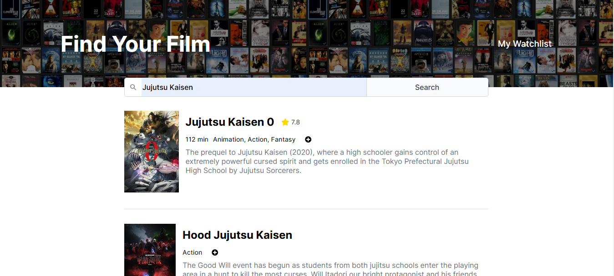

# MovieWatchList

MovieWatchList is a React application that allows users to search movies by providing a title and manage a list of movies they want to watch.
This project is live at: https://moviefinderproject.netlify.app/


## Features

- Search Movies through title
- Maintain a Watch List


## OMDb API
This project uses [OMDb API](https://www.omdbapi.com/) to fetch movies. 

## Installation

1. Clone the repository:
   ```bash
   git clone https://github.com/yourusername/MovieWatchList.git
   ```
2. Navigate to the project directory:
   ```bash
   cd MovieWatchList
   ```
3. Install dependencies:
   ```bash
   npm install
   ```
4. Visit https://www.omdbapi.com/apikey.aspxa and generate an API Key
5. Create a .env file in the root directory, and save the api key as `VITE_API_KEY`
   ```
   VITE_API_KEY = <PLACE_API_KEY_HERE>
   ```

## Usage

1. Start the development server:
   ```bash
   npm run dev
   ```
2. Open your browser and navigate to `http://localhost:5173`.

## Contributing

Contributions are welcome! Please open an issue or submit a pull request for any changes.

## License

This project is licensed under the MIT License.
